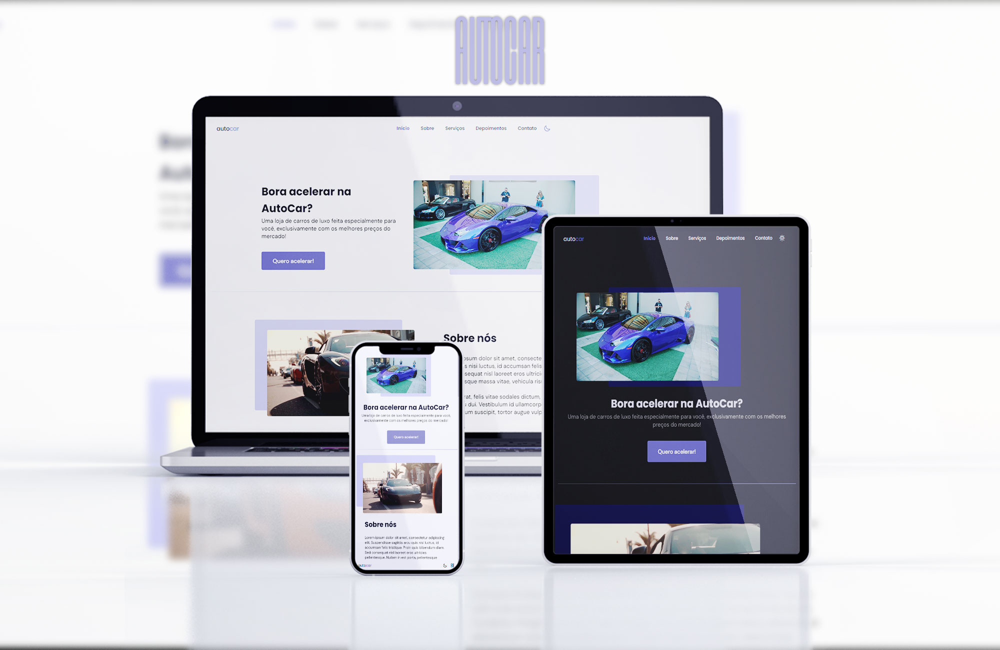

# AutoCar

> Site produzido durante a trilha Origin da NLW Together feita pela RocketSeat, modificada para uso por uma concessionária de carros de luxo.

## 📫 Contribuindo para a AutoCar

1. Fork este repositório.
2. Crie uma branch `git checkout -b <branch_name>`.
3. Faça suas alterações e confirme-as: `git commit -m '<commit_message>'`
4. Envie para a filial original: `git push origin <project_name> / <location>`
5. Crie a solicitação pull.

Como alternativa, consulte a documentação do GitHub em [como criar uma solicitação pull](https://help.github.com/en/github/collaborating-with-issues-and-pull-requests/creating-a-pull-request).
